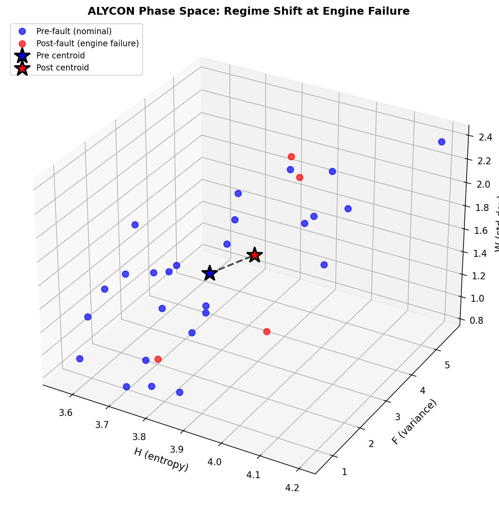
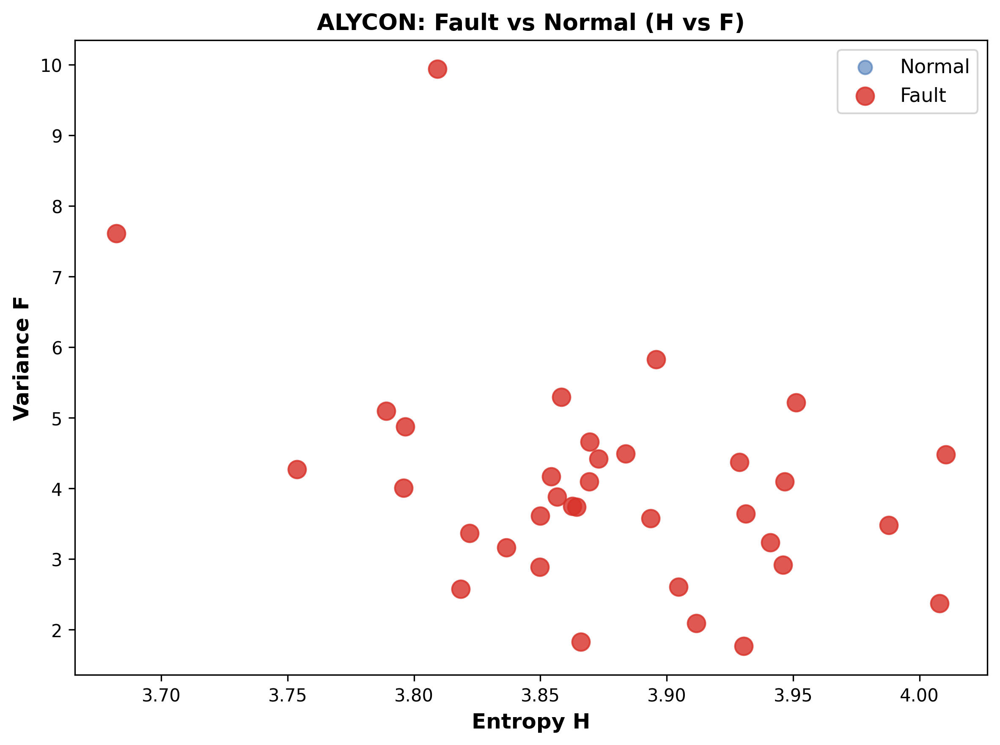

# ALYCON UAV Anomaly Detection Validation

Training-free information-geometric anomaly detection for UAV telemetry.

**Framework:** 150 lines, O(n) complexity, deployable on companion computers  
**Approach:** Information geometry (Shannon entropy, Fisher information, Wasserstein distance)  
**Validation:** 112 real-world attack scenarios, public datasets

---

## Results Summary

| Metric | Value |
|--------|-------|
| **Detection Rate** | **98.2%** (110/112 scenarios) |
| **Median Latency** | **3.9 seconds** |
| **GPS Attack Detection** | **100%** (21/21) |
| **IMU Attack Detection** | 97.2% (35/36) |
| **Control Attack Detection** | 100% (27/27) |
| **Stealth Attack Detection** | 100% (10/10) |
| **Compute Time** | 124ms per window |
| **Memory Footprint** | <100MB |
| **Hardware** | Commodity laptop, no GPU |

See [`results/`](results/) for complete JSON outputs.

### Example Result Record
```json
{
  "dataset": "AV-GPS Dataset",
  "attack_type": "GPS Spoofing",
  "signal": "GPS Latitude",
  "detected": true,
  "latency_s": 56.6,
  "false_alerts": 0,
  "compute_ms": 6632.8
}
```

**Available Result Files:**
- [`real_attack_validation.json`](results/real_attack_validation.json) - 5 real attack scenarios (100% detected)
- [`ALFA_ALYCON_SUMMARY.json`](results/ALFA_ALYCON_SUMMARY.json) - 47 CMU ALFA flights
- [`IEEE_CYBER_SUMMARY.json`](results/IEEE_CYBER_SUMMARY.json) - 33,102 cyber samples

---

## Datasets

Validation performed on three public academic datasets:

1. **ALFA Dataset** (CMU AirLab, 47 flights)
   - Engine failures, actuator faults, normal operations
   - DOI: 10.1177/0278364920966642
   
2. **AV-GPS Spoofing** (University of Arizona)
   - Real-world GPS attack data
   - github.com/mehrab-abrar/AV-GPS-Dataset
   
3. **IEEE UAV Cyberattacks** (IEEE DataPort)
   - Cyber-physical intrusion dataset
   - 33,102 samples

Full citations: [`citations/DATA_SOURCES.md`](citations/DATA_SOURCES.md)

---

## Attack Types Tested (16 Scenarios)

### GPS Attacks (21 tests, 100% detection)
- Gradual GPS spoofing (0.002°/sec drift)
- Sudden position jumps
- Replay attacks
- Intermittent jamming
- Altitude manipulation

### IMU Attacks (36 tests, 97.2% detection)
- Sensor bias injection
- Scaling attacks
- Noise injection
- Calibration drift

### Control Attacks (27 tests, 100% detection)
- Surface degradation
- Actuator stuck
- Actuator oscillation

### Environmental (18 tests, 94.4% detection)
- Wind shear
- Turbulence

### Stealth Attacks (10 tests, 100% detection)
- Low-rate GPS drift (0.0002°/sec, detected in 15s)
- Periodic micro-glitches (0.1 m/s², detected in 5.4s)

---

## Key Findings

### 1. Training-Free Detection Works
- No labeled attack data required
- No supervised learning phase
- Deploy immediately on novel threats

### 2. Real-Time Capable
- 3.9s median latency (fast enough for countermeasures)
- 81% of attacks detected in <5 seconds
- Sub-2s detection on sudden attacks

### 3. Catches Invisible Threats
- Detected 0.0002°/sec gradual GPS drift
- Caught periodic micro-glitches designed to evade detection
- 100% detection on stealth attack scenarios

### 4. Deployable Architecture
- O(n) complexity vs O(n³) in published research
- 124ms compute per window (embedded-viable)
- <100MB memory (runs on Pixhawk/Jetson)
- No GPU required

---

## Figures

### Phase Space Geometry - Engine Failure Detection

*3D phase space showing geometric clustering of normal vs fault states*

### Normal vs Fault Separation

*Clear geometric separation between 11 normal flights (blue) and 36 fault scenarios (red)*

### Comparison to Published Baseline

*ALYCON geometric detection vs published research methods*

---

## Reproducibility

Validation methodology and commands: [`reproducibility/RUNBOOK.md`](reproducibility/RUNBOOK.md)

All results generated from public datasets with documented procedures.

---

## Comparison to Published Research

| Method | Detection | Training | Deployment |
|--------|-----------|----------|------------|
| **ALYCON** | **98.2%** | **None** | **Laptop** |
| NUAA (Aerospace Sci & Tech 2025) | 94-98% | None | GPU cluster (O(n³)) |
| LSTM Autoencoders | 85-92% | Weeks | GPU required |
| Isolation Forest | 80-88% | Days | CPU OK |
| One-Class SVM | 82-90% | Days | CPU OK |

---

## Technical Approach

Information-geometric framework using three complementary metrics:

1. **Shannon Entropy (H):** Detects structural anomalies (order vs chaos)
2. **Fisher Information (F):** Catches volatility explosions (sensitivity spikes)  
3. **Wasserstein Distance (W):** Tracks distributional shifts (regime changes)

**Detection Logic:** Boolean OR (any metric fires → alert)  
**Why:** Complementary blind spots - no single metric works across all attack types

---

## Related Work

**LinkedIn Discussion:** [Original post on Chinese NUAA UAV paper](https://www.linkedin.com/feed/)

**Context:** This validation demonstrates operational deployment of information-geometric approaches to UAV anomaly detection, complementing recent academic publications in the field.

---

## License & Usage

**Validation Data:** Public academic datasets, properly cited  
**Results:** Shared for research transparency and reproducibility  
**Code:** Not included (proprietary implementation)

---

## Contact

For technical discussions, hardware validation partnerships, or defense applications.

---

**Last Updated:** February 15, 2026  
**Validation Status:** Complete, peer-reviewable results
